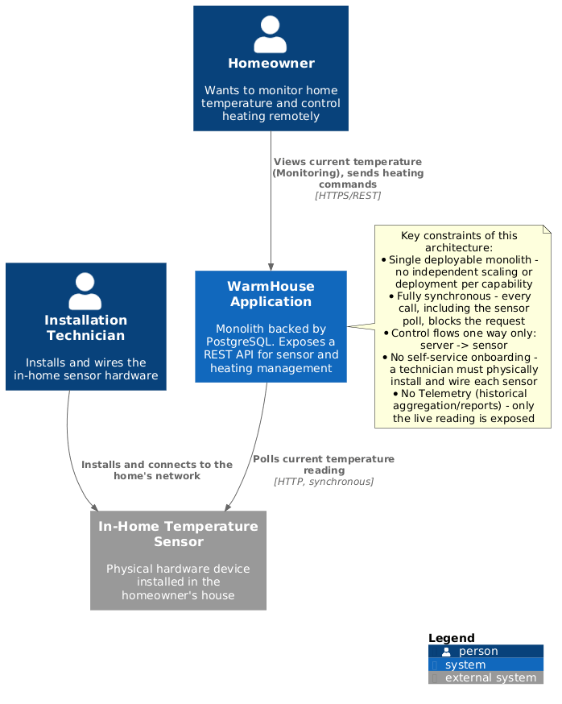
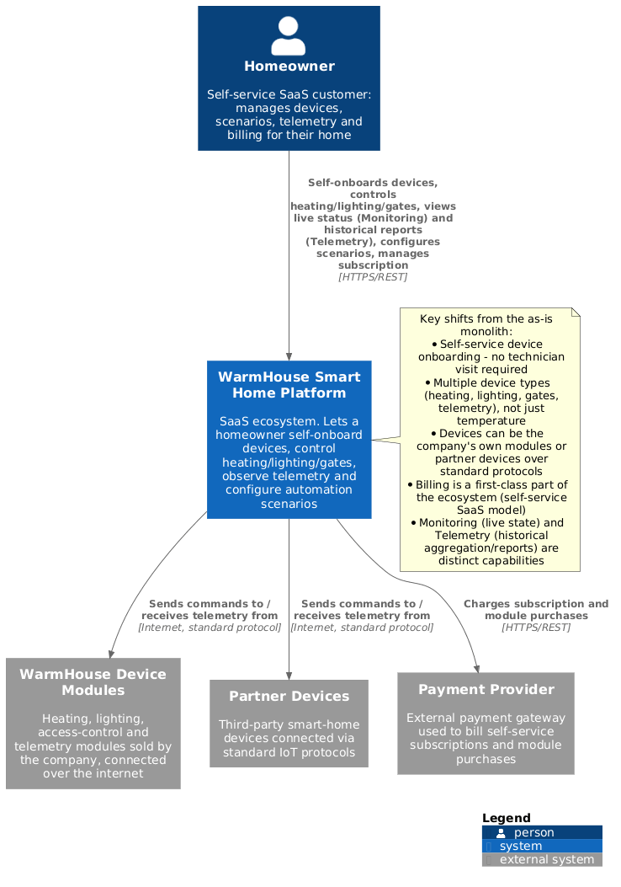
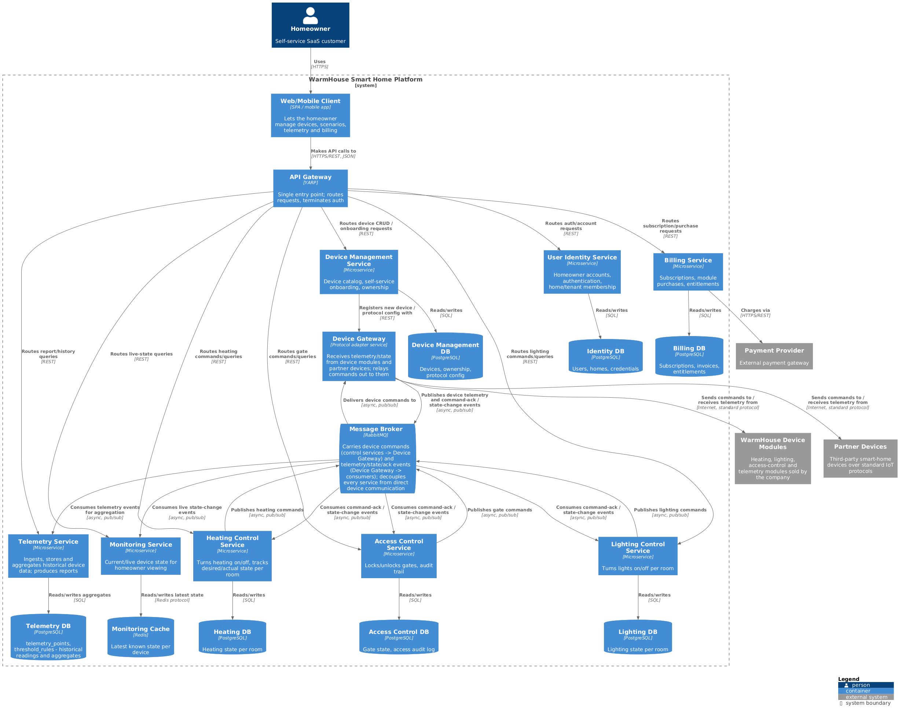
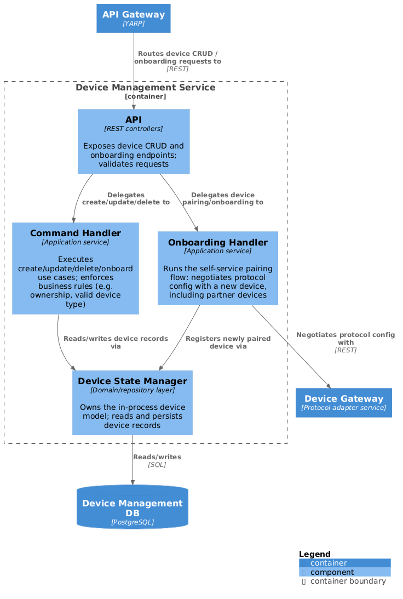
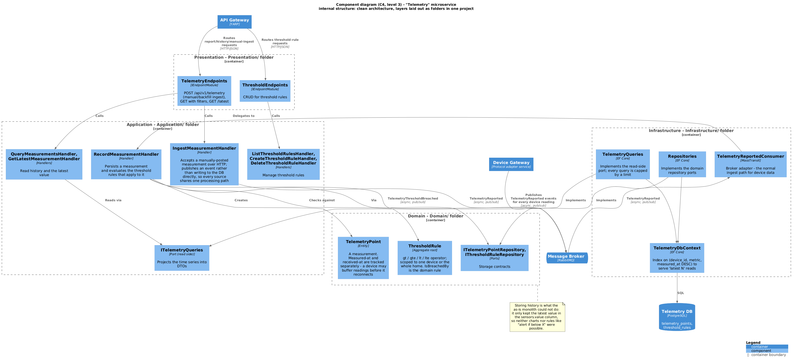
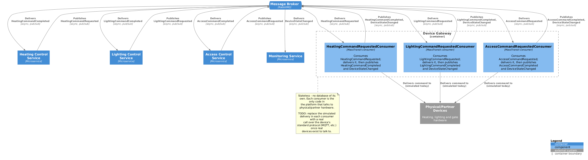
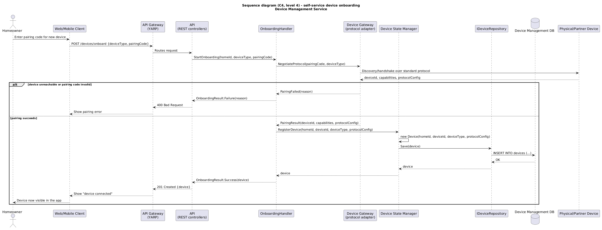
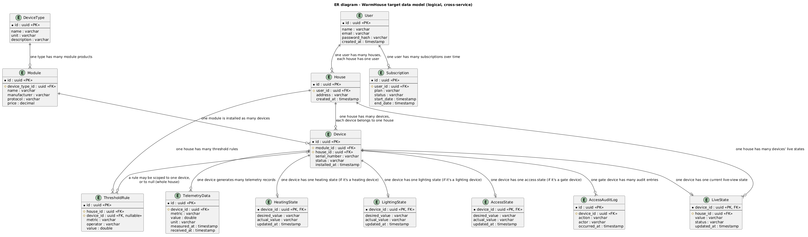

# Project_template

This is a template for the project submission. This file's structure
mirrors the structure of the assignments. Fill it in as you work through
the solution.

# Task 1. Analysis and Planning

<aside>

To put together a document describing the current application
architecture, you can take some of the information from the company
description and the assignment conditions. That's fine.

</aside>

### 1. Description of the monolithic application's functionality

**Heating management:**

- Users can remotely turn heating on/off in their home through the web
  client, which talks to the monolith over this REST API.
- The system supports one sensor/actuator per room today; a sensor's
  writable `status`/`value` fields double as the on/off command and
  target reading, since the domain model has no dedicated "actuator"
  concept separate from "sensor".
- Every command is handled synchronously — the client waits for the
  monolith to accept the change before it returns.

**Temperature monitoring:**

- Users can view the current temperature for each registered sensor
  through the web client.
- The system supports polling live readings on demand: whenever sensors
  are listed or fetched, the monolith calls an external temperature
  service (over plain HTTP) to fetch and merge the latest value, status
  and timestamp before responding.
- Sensor registration (create/update/delete) is persisted in PostgreSQL;
  only the "live" reading comes from the external service on the fly.

### 2. Analysis of the monolithic application's architecture

The current application is a single monolithic backend written in **Go**,
backed by a **PostgreSQL** database, exposing a REST API over HTTPS. All
request handling, business logic and data access run in one deployable
process, and all interaction is synchronous (server calls out to sensors/
services and waits for the response).

### 3. Domain and bounded context definition

- **Device Management.** Owns the catalog of a home's registered
  devices — identity, type, location, ownership — plus self-service
  connection/onboarding of new devices (including partner devices over
  standard protocols) into that catalog. This is the "sensor CRUD" the
  monolith already implements, generalized to cover every device type
  (not just temperature sensors) and to remove the current dependency on
  a technician site visit.
- **Heating Control.** Owns turning heating on/off and tracking its
  desired/actual state per room. Exists today only implicitly, smuggled
  into a device's generic `status`/`value` fields.
- **Lighting Control.** Owns turning lights on/off per room. Does not
  exist in the current monolith — required by the target ecosystem.
- **Access Control.** Owns locking/unlocking automatic gates. Does not
  exist today; kept separate from Heating/Lighting Control because of
  its safety/security requirements.
- **Telemetry.** Owns ingesting, storing and aggregating device data
  over time (temperature readings today; other device signals in the
  target system) for historical analysis and reports. Today this data
  comes from the external "temperature-api" the monolith polls
  synchronously, but nothing is aggregated or reported on yet.
- **Monitoring.** Owns letting a homeowner view the current, live state
  of their home right now (current readings, device status) — as
  opposed to Telemetry's historical aggregation and reports. Today this
  is the "view current temperature" feature of the web client.
- **User Identity.** Owns homeowner accounts, authentication and which
  devices/home belong to which user. Implicit today — the monolith has
  no visible auth/tenancy model — but required as its own context for a
  multi-tenant, self-service product.
- **Billing.** Owns the SaaS self-service subscription and module
  purchase/entitlement per home. Does not exist today, since the current
  model is sold via manual installation rather than self-service
  purchase; required for the target "самообслуживание по модели SaaS"
  model.

Of these, only **Device Management** and **Telemetry/Monitoring** (as
"temperature monitoring") are implemented by the current monolith
today — and even those are fused into one process and one database
rather than separate bounded contexts. Heating Control exists only as a
side effect of the generic device model; Lighting Control, Access
Control, User Identity and Billing are gaps the target architecture
needs to fill.

### 4. Problems of the monolithic solution
- **Control direction:** Always server → device. The monolith initiates
  every read (polling the sensor/temperature service) and every write
  (pushing a heating command); a sensor can never push data to the
  server on its own (no webhooks, no streaming, no pub/sub).
- **Scalability:** Poor. Because everything is one process bound to one
  database, the only scaling lever is running more copies of the whole
  monolith — you cannot scale "temperature reads" independently from
  "heating commands" even though they have very different load profiles.
- **Deployability:** Coupled. A change to any single capability (e.g.
  fixing a bug in temperature polling) requires rebuilding, retesting and
  redeploying the entire application, and requires stopping the whole
  service — there is no independent or zero-downtime deployment per
  capability.
- **Extensibility:** Poor. Adding a new device type (lighting, gates,
  cameras) means growing the same codebase, the same database schema and
  the same deployable, rather than adding an independent, separately
  owned service.

### 5. System context visualization — C4 diagram

**As-is** — how the current monolith interacts with its users and the
physical sensor hardware:



- PlantUML source: [docs/c4/context-as-is.puml](docs/c4/context-as-is.puml)
- Rendered image: [docs/c4/context-as-is.png](docs/c4/context-as-is.png)

**To-be** — how the target self-service SaaS ecosystem interacts with
the homeowner, the company's own device modules, partner devices and a
payment provider:



- PlantUML source: [docs/c4/context-to-be.puml](docs/c4/context-to-be.puml)
- Rendered image: [docs/c4/context-to-be.png](docs/c4/context-to-be.png)

# Task 2. Designing a Microservice Architecture

In this assignment you only need to provide the C4 model diagrams. We're
not asking you to separately describe the resulting microservices or how
you determined the interactions between the To-Be system's components. If
you prepare the C4 diagrams correctly, they will show this on their own.

**Container diagram**



- PlantUML source: [docs/c4/container-to-be.puml](docs/c4/container-to-be.puml)
- Rendered image: [docs/c4/container-to-be.png](docs/c4/container-to-be.png)

**Component diagram**

*Device Management Service*



- PlantUML source: [docs/c4/component-device-management.puml](docs/c4/component-device-management.puml)
- Rendered image: [docs/c4/component-device-management.png](docs/c4/component-device-management.png)

*Telemetry Service*



- PlantUML source: [docs/c4/component-telemetry.puml](docs/c4/component-telemetry.puml)
- Rendered image: [docs/c4/component-telemetry.png](docs/c4/component-telemetry.png)

*Device Gateway*



- PlantUML source: [docs/c4/component-device-gateway.puml](docs/c4/component-device-gateway.puml)
- Rendered image: [docs/c4/component-device-gateway.png](docs/c4/component-device-gateway.png)

**Code diagram**

*Self-service device onboarding (sequence diagram) - Device Management Service*



- PlantUML source: [docs/c4/code-device-onboarding.puml](docs/c4/code-device-onboarding.puml)
- Rendered image: [docs/c4/code-device-onboarding.png](docs/c4/code-device-onboarding.png)

# Task 3. Developing an ER Diagram

**Entities:** User, House, DeviceType, Module, Device, DeviceState,
TelemetryData, ThresholdRule, Subscription.

**Key relationships:**

- **User — House:** one user has many houses; each house belongs to
  exactly one user.
- **House — Device:** one house has many devices; each device belongs
  to exactly one house.
- **DeviceType — Module:** one device type (heating/lighting/access/
  telemetry) has many purchasable module products.
- **Module — Device:** one module (product) is installed as many
  physical devices; each device is an instance of exactly one module.
- **Device — DeviceState:** one device has exactly one current state
  record (desired vs. actual value) — owned by whichever control
  service (Heating/Lighting/Access Control) manages that device type.
- **Device — TelemetryData:** one device generates many telemetry
  records over time.
- **House / Device — ThresholdRule:** one house has many threshold
  rules; a rule is optionally scoped to one specific device, or left
  unscoped to apply to the whole house.
- **User — Subscription:** one user has many subscriptions over time
  (billing/self-service SaaS plan history).



- PlantUML source: [docs/erd/erd.puml](docs/erd/erd.puml)
- Rendered image: [docs/erd/erd.png](docs/erd/erd.png)

# Task 4. Creating and Documenting the API

### 1. API type

**Two API types, depending on who's talking to whom:**

- **REST over HTTPS** for client-facing traffic: the Web/Mobile Client
  only ever talks to the API Gateway, and the Gateway talks to each
  microservice, over REST. This is the right fit here because the
  homeowner is waiting for a response (list my devices, view a report,
  submit a payment) - synchronous request/response is the natural shape
  for that interaction, and REST/JSON is the simplest thing that works
  for a browser/mobile client.
- **Asynchronous pub/sub over RabbitMQ** for device commands and
  telemetry between services: Heating/Lighting/Access Control publish
  commands, the Device Gateway consumes them and relays them to
  hardware, then publishes telemetry and command-ack/state-change
  events back for Monitoring and Telemetry to consume independently
  (see docs/c4/container-to-be.puml). This is the fix for the as-is
  monolith's core problem from Task 1: everything there was
  synchronous, so a slow or offline device blocked the request thread
  that was polling it. With pub/sub, a publisher doesn't wait for, or
  even know about, its subscribers - it lets new consumers (e.g. a
  future Notifications service) be added later without touching the
  services that already exist, and it tolerates devices that are
  intermittently connected instead of assuming they always answer
  immediately.

**Message shape:** one event type per domain event, not a generic
envelope consumers have to branch on. Every publisher and consumer
references the same shared contracts project
([src/Common/WarmHouse.Contracts](src/Common/WarmHouse.Contracts)) so
the message shape can never drift between services. Implemented so far,
via [MassTransit](https://masstransit.io/) over RabbitMQ:

- `HeatingCommandRequested` / `HeatingCommandCompleted` - Heating
  Control Service &harr; Device Gateway
- `LightingCommandRequested` / `LightingCommandCompleted` - Lighting
  Control Service &harr; Device Gateway
- `AccessCommandRequested` / `AccessCommandCompleted` - Access Control
  Service &harr; Device Gateway
- `DeviceStateChanged` - Device Gateway &rarr; Monitoring Service

**Reliability trade-off we deliberately made:** this implementation
publishes right after the Npgsql write completes, with no transactional
outbox and no consumer-side inbox. That's simpler, but it means a crash
between the database write and the publish can drop an event, and a
redelivered message isn't guaranteed to be a no-op. A production system
would add both (write the outgoing event to the same database
transaction as the state change, and have each consumer record
processed message ids) - we chose not to here to avoid pulling EF Core
into services that otherwise use raw Npgsql throughout.

We are not using gRPC or GraphQL here: gRPC would add a schema/tooling
step that isn't needed for either the browser-facing traffic (REST/JSON
is simpler and universally supported) or the event traffic (which needs
pub/sub semantics gRPC doesn't provide on its own); GraphQL solves a
client-side over/under-fetching problem this system doesn't have, since
each client screen maps closely to one service's REST resource.

### 2. API documentation

Every REST microservice uses the same shared Swagger/OpenAPI setup
([src/Common/WarmHouse.WebDefaults](src/Common/WarmHouse.WebDefaults)'s
`AddApiDocumentation`/`UseApiDocumentation` extension methods, built on
[Swashbuckle.AspNetCore](https://github.com/domaindrivendev/Swashbuckle.AspNetCore))
so each service gets an interactive Swagger UI at `/swagger` and its raw
OpenAPI document at `/swagger/v1/swagger.json` - reachable directly on
the service's own port, or through the API Gateway (which forwards the
path after stripping its `/api/v1/<service>` prefix). Once
`docker compose up` is running:

| Service | Direct | Via API Gateway |
|---|---|---|
| Device Management | [localhost:5001/swagger](http://localhost:5001/swagger) | [localhost:5000/api/v1/devices/swagger](http://localhost:5000/api/v1/devices/swagger) |
| Heating Control | [localhost:5002/swagger](http://localhost:5002/swagger) | [localhost:5000/api/v1/heating/swagger](http://localhost:5000/api/v1/heating/swagger) |
| Lighting Control | [localhost:5003/swagger](http://localhost:5003/swagger) | [localhost:5000/api/v1/lighting/swagger](http://localhost:5000/api/v1/lighting/swagger) |
| Access Control | [localhost:5004/swagger](http://localhost:5004/swagger) | [localhost:5000/api/v1/access/swagger](http://localhost:5000/api/v1/access/swagger) |
| Monitoring | [localhost:5005/swagger](http://localhost:5005/swagger) | [localhost:5000/api/v1/monitoring/swagger](http://localhost:5000/api/v1/monitoring/swagger) |
| Telemetry | [localhost:5006/swagger](http://localhost:5006/swagger) | [localhost:5000/api/v1/telemetry/swagger](http://localhost:5000/api/v1/telemetry/swagger) |
| User Identity | [localhost:5007/swagger](http://localhost:5007/swagger) | [localhost:5000/api/v1/identity/swagger](http://localhost:5000/api/v1/identity/swagger) |
| Billing | [localhost:5008/swagger](http://localhost:5008/swagger) | [localhost:5000/api/v1/billing/swagger](http://localhost:5000/api/v1/billing/swagger) |

The **Device Gateway** isn't in this table - it has no REST API to
document (it only exposes `/health`; everything else it does is via
RabbitMQ consumers - see its
[component diagram](docs/c4/component-device-gateway.puml)).

# Task 5. Working with docker and docker-compose

Go to `apps`.

That's where the monolith application for working with temperature
sensors lives. The README.md there describes how to run the solution.

You need to:

1) Build a simple temperature-api application, in any programming
   language convenient for you, that returns a random temperature value
   when queried at `/temperature?location=`.

Location is the room name, sensorId is the identifier for the room name.

```
	// If no location is provided, use a default based on sensor ID
	if location == "" {
		switch sensorID {
		case "1":
			location = "Living Room"
		case "2":
			location = "Bedroom"
		case "3":
			location = "Kitchen"
		default:
			location = "Unknown"
		}
	}

	// If no sensor ID is provided, generate one based on location
	if sensorID == "" {
		switch location {
		case "Living Room":
			sensorID = "1"
		case "Bedroom":
			sensorID = "2"
		case "Kitchen":
			sensorID = "3"
		default:
			sensorID = "0"
		}
	}
```

2) The application should be packaged in Docker and added to
   docker-compose. The default port should be 8081.

3) In addition, the smart_home application requires a database — add
   settings to the docker-compose file to run postgres, specifying the
   initialization script `./smart_home/init.sql`.

To verify, you can use the Postman collection
`smarthome-api.postman_collection.json` and call:

- Create Sensor
- Get All Sensors

A different temperature value should be shown on every call.

The reviewer will check it the exact same way.
